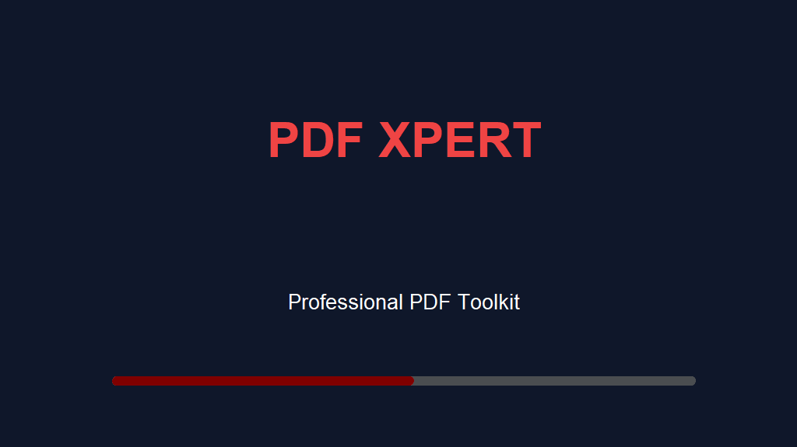
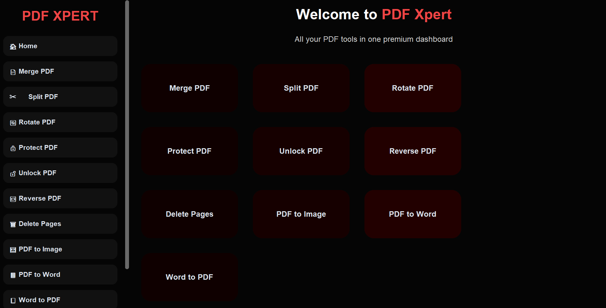
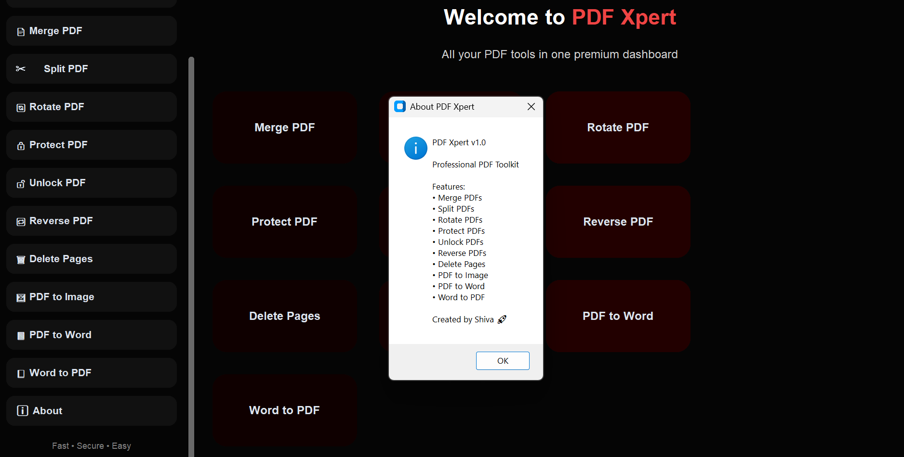
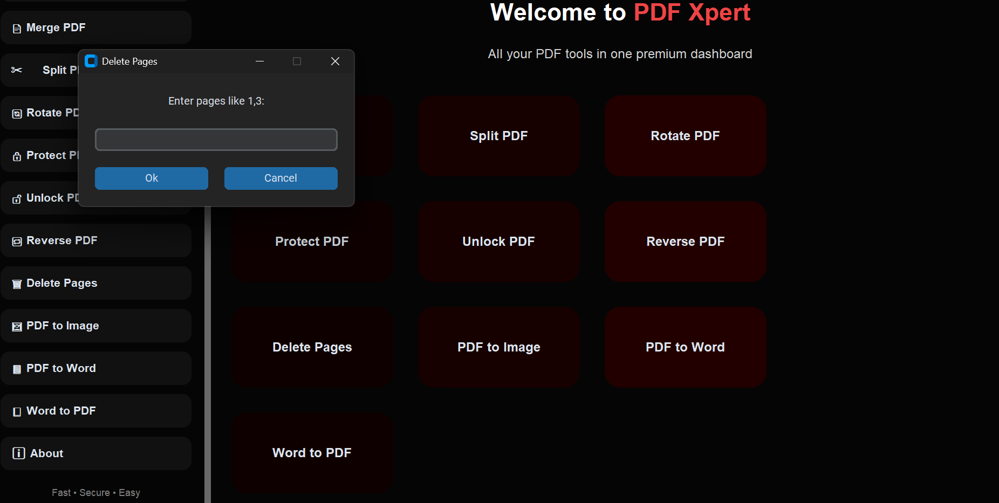
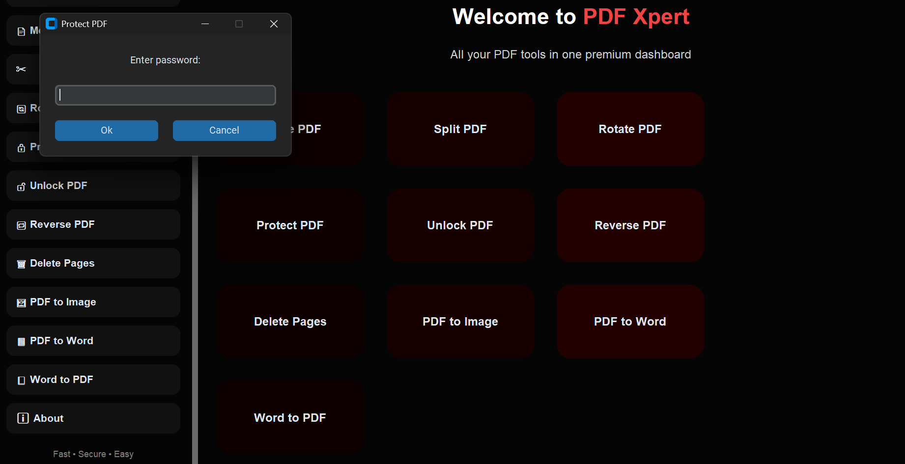
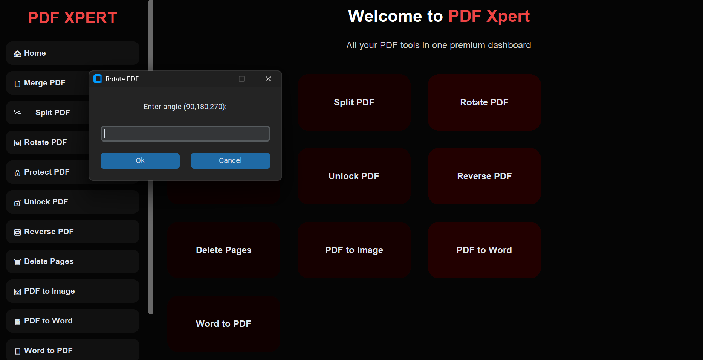

# PDF XPERT

PDF XPERT is a modern desktop PDF utility application built using Python and CustomTkinter. It provides multiple PDF management tools through a clean and user-friendly graphical interface.

## Features

* Merge PDF files
* Split PDF files
* Rotate PDF pages
* Protect PDF with password
* Unlock protected PDF files
* Reverse PDF page order
* Delete selected pages
* Convert PDF to Image
* Convert PDF to Word
* Convert Word to PDF

## Technologies Used

### Programming Language

* Python

### Libraries

* CustomTkinter
* PikePDF
* PyMuPDF (fitz)
* PDF2DOCX
* DOCX2PDF

### Deployment Tools

* PyInstaller
* Inno Setup

## Project Structure

```text
PDF_XPERT_V2
├── backend.py
├── modern_ui.py
├── assets/
├── pdfxpert.ico
├── requirements.txt
├── PDF_XPERT_SETUP.iss
└── README.md
```

## Installation

1. Clone the repository

```bash
git clone https://github.com/Shiva611/PDF-XPERT.git
```

2. Navigate to the project directory

```bash
cd PDF-XPERT
```

3. Install dependencies

```bash
pip install -r requirements.txt
```

4. Run the application

```bash
python modern_ui.py
```


## Project Architecture

Frontend:

* Built using CustomTkinter
* Handles user interface, buttons, dialogs, and navigation

Backend:

* Handles PDF processing logic
* Performs merge, split, rotate, protect, unlock, conversion, and page management operations

## Screenshots

### Splash Screen


### Dashboard


### About Window


### Delete Pages


### Protect PDF


### Rotate PDF


## Learning Outcomes

Through this project I learned:

* GUI Development
* File Handling
* PDF Processing
* Exception Handling
* Debugging
* Application Packaging
* Installer Creation
* Software Deployment

## Author

Shiva Pandey

## Version

PDF XPERT v1.0
